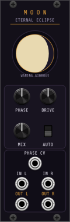
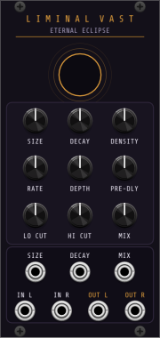
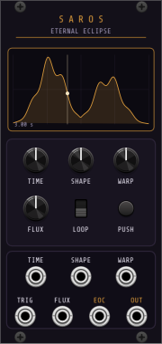
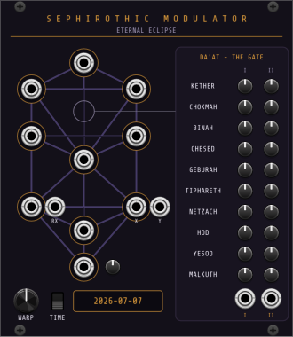
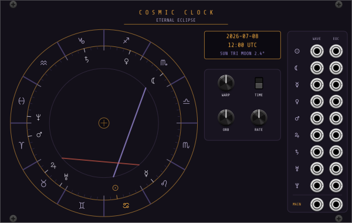

# Eternal Eclipse Modular

VCV Rack 2 plugin by Eternal Eclipse. Licensed GPL-3.0-or-later.

Module sources live in per-module folders under `src/`; shared panel styling is in
`src/EclipseWidgets.hpp` (dark violet panels, amber accents, runtime-drawn labels).

## Modules

### Moon Phase Distortion



Stereo distortion whose depth and character follow the phase of the moon — computed
from your system clock in AUTO mode, or set by the PHASE knob and CV in manual mode.
New moon is nearly clean; drive grows with illumination toward saturation and
wavefolding at full moon, and waxing/waning phases bias the shaper asymmetrically
in opposite directions. Polyphonic; right input normalled to left. The panel
displays the current moon.

### Liminal Vast Reverb



Lush stereo reverb. Pre-delay and allpass diffusion
feed an 8-line feedback delay network whose read taps are each modulated by their own
detuned LFO, giving a chorused, shimmering tail. SIZE scales the network from intimate
rooms to the endless liminal vast, DECAY is calibrated RT60 (0.2s–70s), with DENSITY,
mod RATE/DEPTH, LO/HI CUT, and MIX shaping the character. CV over size, decay, and mix;
right input normalled to left.

### Saros



Envelope and modulation generator named for the ~18-year cycle after which eclipses
repeat. A bank of 16 shapes (plucks, ramps, bells, ripples,
stairs, bounces, drifts) morphed continuously by SHAPE, skewed in time by WARP, and
carved with rhythmic notches by FLUX. TIME stretches the envelope from 5 ms to
30 minutes; LOOP turns it into a slow modulation source, with trigger input/button
and end-of-cycle output. The screen shows the current curve, a live playhead, and the
cycle time — and it is drawable: sketch any shape on it with the mouse and the
envelope follows your drawing (WARP and FLUX still apply). The context menu switches
between drawn and bank shapes and clears the drawing. CV over time, shape, warp, and
flux; bipolar ±5V output via context menu.

### Sephirothic Modulator



Tree of Life planetary CV matrix. Ten outputs laid out in the traditional three-pillar
geometry, each a self-contained astrological signal computed from Keplerian orbital
elements and the system clock — no network, just the sky. Kether/Neptune drifts near-DC;
Chokmah/Uranus steps through the zodiac as 12 chromatic 1/12 V steps; Binah/Saturn and
Chesed/Jupiter tick as structural clocks; Geburah/Mars runs an eccentric LFO;
Tiphareth/Sun ramps over the solar year; Netzach/Venus outputs an X/Y pair tracing the
8-year Venus pentagram (feed it to a scope); Hod/Mercury follows solar elongation and
fires a trigger at each real retrograde station; Yesod/Moon outputs lunar phase
illumination; Malkuth is the manually set tonic. A TIME switch chooses the real sky or
WARP mode (up to ×10⁸, about three years per second) with an ephemeris date readout,
and the Da'at matrix mixes any blend of the ten influences into two bus outputs.

### Cosmic Clock



Astrological waveform engine inspired by the Kabbalah Society's Cosmic Clock. Nine
planetary LFO voices, each an archetypal shape — the Sun an intense triangle, the Moon
a sine whose amplitude follows the real lunar phase, Mercury stepped, Venus five-lobed,
Mars a hard ramp, Jupiter a broad swell, Saturn slow rounded plateaus, Uranus erratic,
Neptune two beating sines — colored by the zodiac sign each currently transits (fire
sharpens, earth quantizes, air shimmers, water slews; mutable signs morph the shape
cycle to cycle). Aspects between planets act as the mixer: MAIN sums every voice
weighted by the live aspect intensities, and each voice has its own output plus an
end-of-cycle trigger — no gates anywhere. The panel is a chart-of-the-moment zodiac
wheel with hand-drawn glyphs, planet markers at true longitudes, aspect chords colored
by type (conjunction white, sextile teal, square ember, trine violet, opposition
amber), and a date/time + strongest-aspect readout. RATE scales all voices, ORB sets
aspect width, and TIME/WARP runs the real sky or time-lapse up to ×10⁸.

All Eternal Eclipse audio modules are stereo.

## Building

Requires the [VCV Rack SDK](https://vcvrack.com/downloads) (2.4 or newer) and a
[Rack-compatible toolchain](https://vcvrack.com/manual/Building) (MSYS2 mingw64 on Windows).
The Makefile expects the SDK at `./Rack-SDK` (override with `RACK_DIR=<path>`).

```sh
make -j8       # build
make install   # package and install to your Rack user folder
```
