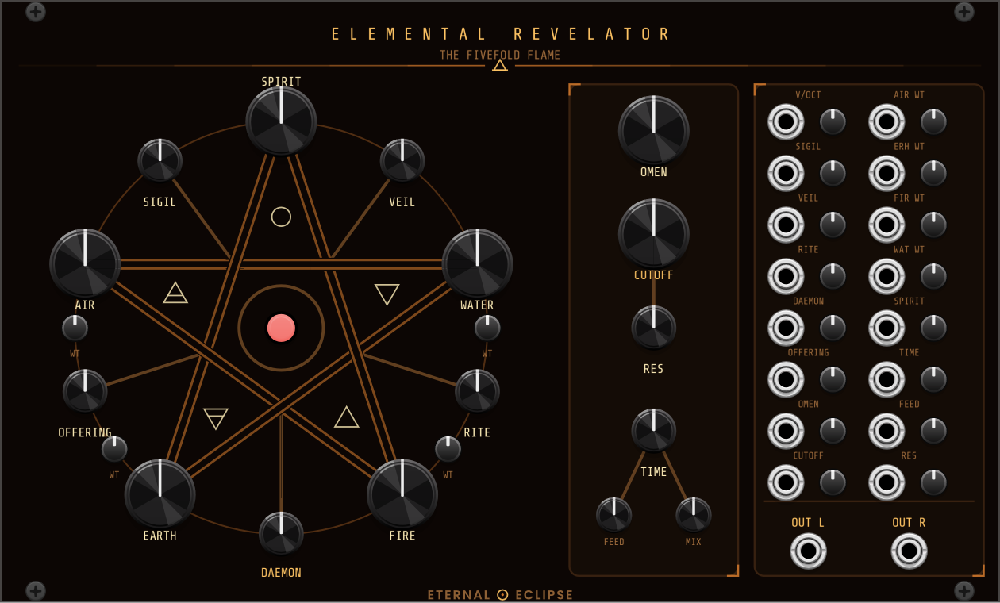
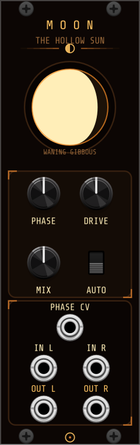
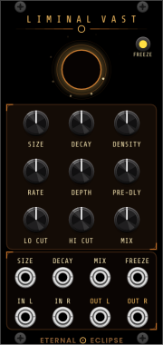
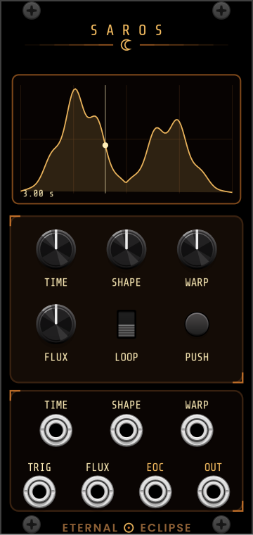
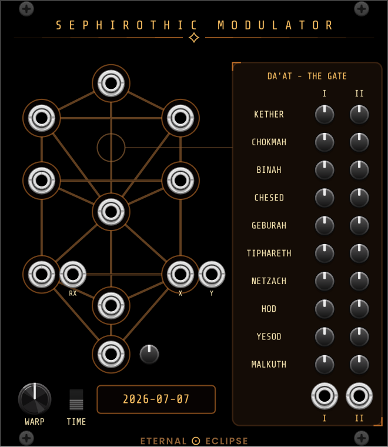
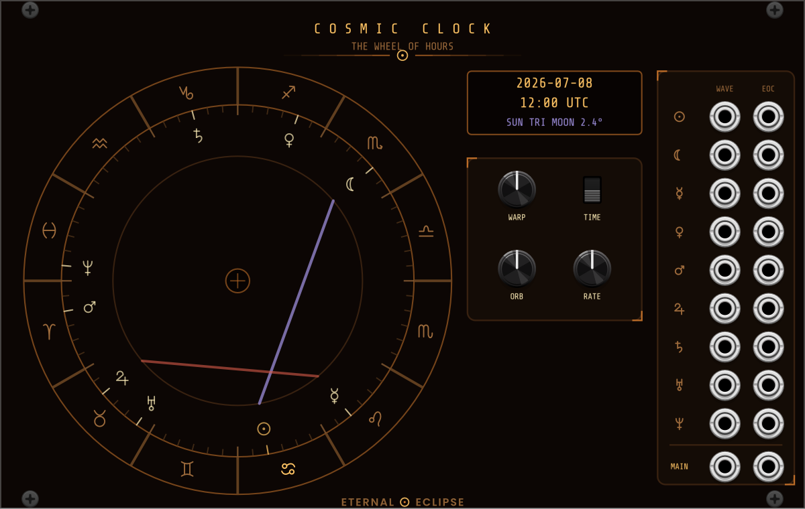
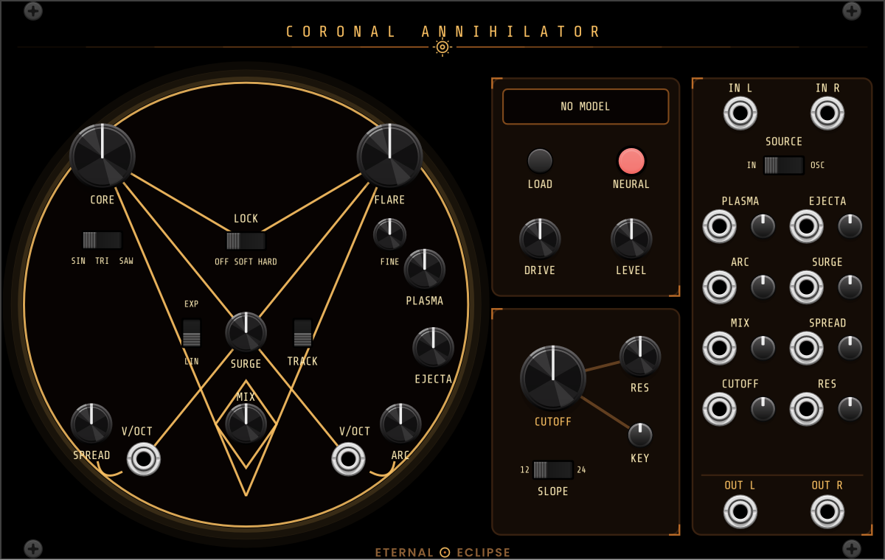
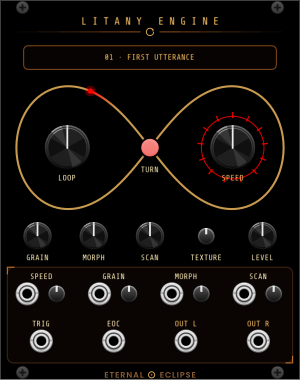

# Eternal Eclipse Modular

VCV Rack 2 plugin by Eternal Eclipse. Licensed GPL-3.0-or-later.

Module sources live in per-module folders under `src/`; shared panel styling is in
`src/EclipseWidgets.hpp` (copper-on-abyss: warm near-black panels, tiered copper/gold
text, runtime-drawn labels — matching the Church of the Eternal Eclipse brand). Each
panel carries its chamber glyph in the header divider and the ETERNAL ⊙ ECLIPSE brand
mark flush against the bottom edge.

## Modules

### Elemental Revelator



Four-element wavetable synth voice. AIR, WATER, EARTH, and FIRE oscillators sit at
the points of a pentagram, each with its own pitch knob and WT wavetable-position
knob; OFFERING sets the scan character for all four, from smooth morphing to hard
stepped wave switching. SIGIL cross-modulates around the elemental ring
(AIR→WATER→FIRE→EARTH→AIR, PM left / FM right, wavefolding at the extremes) and
RITE ring-modulates the opposing pairs (AIR×FIRE, WATER×EARTH). VEIL spreads detune
and stereo width. Engaging the SPIRIT switch at the pentagram's center summons the
fifth element: the four tunings become a chromatic 4-voice chord — AIR stays live as
the root — and the SPIRIT knob scrolls 24 voicings. The DAEMON knob calls one of 72
daemons (eight banks of nine), each a complete voice configuration, crossfaded
smoothly and scannable by CV; a 64-step OMEN knob dials deterministic variations.
The voice runs through a classic 4-pole ladder lowpass (CUTOFF/RES, self-oscillates)
into a stereo delay/diffusion processor with a frequency shifter in the feedback
path (TIME/FEED/MIX). Sixteen CV inputs with attenuverters cover every gesture.

### Moon Phase Distortion



Stereo distortion whose depth and character follow the phase of the moon — computed
from your system clock in AUTO mode, or set by the PHASE knob and CV in manual mode.
New moon is nearly clean; drive grows with illumination toward saturation and
wavefolding at full moon, and waxing/waning phases bias the shaper asymmetrically
in opposite directions. Polyphonic; right input normalled to left. The panel
displays the current moon.

### Liminal Vast Reverb



Lush stereo reverb. Pre-delay and allpass diffusion
feed an 8-line feedback delay network with diffusion allpasses inside the loop, each
read tap modulated by two detuned LFOs for a chorused, washy, shimmering tail. SIZE
scales the network from intimate rooms to the endless liminal vast, DECAY is
calibrated RT60 (0.2s to ∞ at the top of the knob), and FREEZE — button or gate —
holds the tail forever. DENSITY, mod RATE/DEPTH, LO/HI CUT, and MIX shape the
character; CV over size, decay, and mix; right input normalled to left. The eclipse
on the panel is alive: its corona glows with the tail's energy and embers drift from
the rim with the incoming signal.

### Saros



Envelope and modulation generator named for the ~18-year cycle after which eclipses
repeat. A bank of 16 shapes (plucks, ramps, bells, ripples,
stairs, bounces, drifts) morphed continuously by SHAPE, skewed in time by WARP, and
carved with rhythmic notches by FLUX. TIME stretches the envelope from 5 ms to
30 minutes; LOOP turns it into a slow modulation source, with trigger input/button
and end-of-cycle output. The screen shows the current curve, a live playhead, and the
cycle time — and it is drawable: sketch any shape on it with the mouse and the
envelope follows your drawing (WARP and FLUX still apply). The context menu switches
between drawn and bank shapes and clears the drawing. CV over time, shape, warp, and
flux; bipolar ±5V output via context menu.

### Sephirothic Modulator



Tree of Life planetary CV matrix. Ten outputs laid out in the traditional three-pillar
geometry, each a self-contained astrological signal computed from Keplerian orbital
elements and the system clock — no network, just the sky. Kether/Neptune drifts near-DC;
Chokmah/Uranus steps through the zodiac as 12 chromatic 1/12 V steps; Binah/Saturn and
Chesed/Jupiter tick as structural clocks; Geburah/Mars runs an eccentric LFO;
Tiphareth/Sun ramps over the solar year; Netzach/Venus outputs an X/Y pair tracing the
8-year Venus pentagram (feed it to a scope); Hod/Mercury follows solar elongation and
fires a trigger at each real retrograde station; Yesod/Moon outputs lunar phase
illumination; Malkuth is the manually set tonic. A TIME switch chooses the real sky or
WARP mode (up to ×10⁸, about three years per second) with an ephemeris date readout,
and the Da'at matrix mixes any blend of the ten influences into two bus outputs.

### Cosmic Clock



Astrological waveform engine inspired by the Kabbalah Society's Cosmic Clock. Nine
planetary LFO voices, each an archetypal shape — the Sun an intense triangle, the Moon
a sine whose amplitude follows the real lunar phase, Mercury stepped, Venus five-lobed,
Mars a hard ramp, Jupiter a broad swell, Saturn slow rounded plateaus, Uranus erratic,
Neptune two beating sines — colored by the zodiac sign each currently transits (fire
sharpens, earth quantizes, air shimmers, water slews; mutable signs morph the shape
cycle to cycle). Aspects between planets act as the mixer: MAIN sums every voice
weighted by the live aspect intensities, and each voice has its own output plus an
end-of-cycle trigger — no gates anywhere. The panel is a chart-of-the-moment zodiac
wheel with hand-drawn glyphs, planet markers at true longitudes, aspect chords colored
by type (conjunction cream, sextile teal, square ember, trine violet, opposition
copper), and a date/time + strongest-aspect readout. RATE scales all voices, ORB sets
aspect width, and TIME/WARP runs the real sky or time-lapse up to ×10⁸.

### Coronal Annihilator



Stereo synth voice in three stages. SOURCE blends (with CV) between the external
stereo input (R normalled to L) and the onboard dual oscillator: CORE (sine, triangle or saw) drives
FLARE through SURGE (linear through-zero or exponential FM), LOCK (soft or hard sync)
and TRACK (FLARE follows CORE's V/oct), while FLARE itself is shaped by PLASMA
(sine → triangle → saw → pulse morph), ARC (phase warp) and EJECTA (wavefolding).
MIX balances the two and SPREAD places CORE left and FLARE right. The NEURAL stage
plays a neural amp model (.nam file — load one from the panel button, the display,
the context menu, or by dropping the file on the module) with one network per
channel, DRIVE into it and a WET/DRY blend out (the dry arm is latency-aligned, so
any blend position stays comb-free), both with CV; the menu offers a mono-network
mode (half the CPU) and loudness normalization. UMBRA is a saturating 4-pole lowpass with resonance
into self-oscillation, 12 or 24 dB slopes, CV and key tracking. Every main control
has a CV input with an attenuverter. Models are not bundled — bring your own
captures; the stage passes signal through until one is loaded. Note that the neural
path adds a small block latency (32 samples, plus conversion when the model's rate
differs from the engine's).

A note on CPU: an amp capture is a neural network, and this module runs one per
channel in real time — a deliberate engineering choice, so expect it to be the
heaviest module in most racks. A standard-size capture costs roughly a quarter to
a third of one core in full stereo on a modern machine; the mono-network menu
option halves that, and lite or LSTM captures cost a small fraction of it.
Inference runs in 32-sample bursts, so Rack's "max" performance meter will flash
past 100% even while the audio is perfectly clean — that is the meter catching a
single burst, not a fault; the average is the number that matters. If your machine
does struggle: raise the audio buffer to 256 or 512 samples, switch to the mono
network, or load a lighter capture.


### Litany Engine



Looping sample player in the spirit of the Buddha Machine: the litany of onboard
loops is the instrument out of the box, and "Load sample folder" in the right-click
menu swaps in your own bank of WAVs per instance ("Restore onboard litany" returns).
User folders are read under strict limits (99 files, 60 s per file, 192 MB per bank,
16-bit in RAM) so a stray folder of stems can't eat your session's memory. LOOP selects
a loop (the display names it and traces the playhead), and TURN, the display, or a
trigger at TRIG steps to the next one. SPEED and LOOP stand on the stem of a gold
Leviathan's Cross whose infinity is the tape path, TURN at its crossing as the head:
a red splice marker orbits it with the loop, its trail lengthening with speed and
reversing with it, ducking under the head each pass. SPEED is a through-zero varispeed —
tape-style, so pitch follows speed, reverse below zero, stopped at zero. The
granular layer is Morphagene-inspired: GRAIN sweeps grain length from the whole
loop (plain looped playback with a crossfaded loop point) down to 15 ms, MORPH
raises grain overlap from single grains to an eight-deep lattice, SCAN offsets
where grains are drawn from the loop, and TEXTURE adds position spray and stereo
pan spread. SPEED, GRAIN, MORPH, SCAN and TEXTURE each have a CV input with an attenuverter;
EOC emits a pulse each time the tape wraps. Loops are decoded once on a background
thread and shared across instances. Stereo out at ±5 V — patch it into the Coronal
Annihilator's external input to run the litany through a neural amp model.

All Eternal Eclipse audio modules are stereo.

## Building

Requires the [VCV Rack SDK](https://vcvrack.com/downloads) (2.4 or newer) and a
[Rack-compatible toolchain](https://vcvrack.com/manual/Building) (MSYS2 mingw64 on Windows).
The Makefile expects the SDK at `./Rack-SDK` (override with `RACK_DIR=<path>`).

```sh
make -j8       # build
make install   # package and install to your Rack user folder
```

Third-party code vendored under `dep/`: NeuralAmpModelerCore (MIT, with a small
documented patch — see `dep/NeuralAmpModelerCore/PATCHES.md`), Eigen (MPL2),
nlohmann/json (MIT) and dr_wav (public domain / MIT-0). Their licenses ship with
the plugin.
